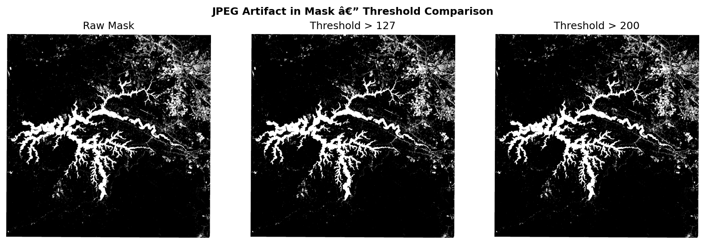
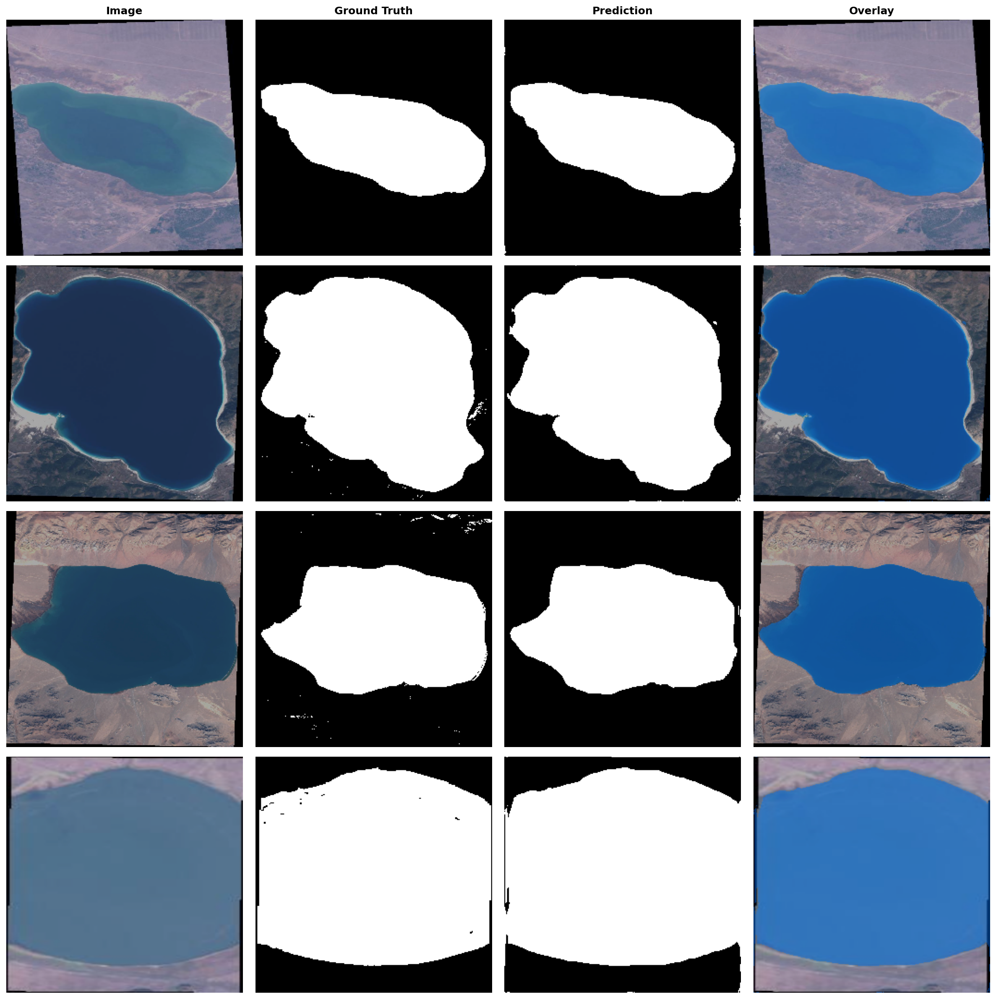

# Water Body Segmentation

Binary segmentation of water bodies from Sentinel-2 satellite imagery using U-Net + ResNet34.

## Quick Start

```bash
git clone https://github.com/Angelgupta13/water-segementation.git
cd water-segementation
git lfs pull        # fetches model.onnx (97 MB)
pip install -e .    # installs package + deps
docker build -t water-seg . && docker run -p 8000:8000 water-seg
curl -X POST http://localhost:8000/predict -F "file=@image.jpg" -o mask.png
```

## Assignment Requirements Coverage

| Requirement | Implementation | Location |
|---|---|---|
| Data Ingestion & Preprocessing | Loads 2,841 image-mask pairs, resizes to 256×256, normalizes (ImageNet), augments (flip/rotate/color), tiles large rasters | `src/ingestion/dataset.py` |
| Model Training & Evaluation | U-Net + ResNet34, BCE+Dice loss, AdamW, CosineAnnealingLR, early stopping, IOU/Accuracy/Precision/Recall metrics | `src/training/train.py`, `model.py`, `utils.py` |
| Hyperparameter Tuning | Grid search over LR (1e-4, 5e-5, 1e-5) and batch size (8, 16) with MLflow tracking | `src/training/hypertune.py` |
| Inference Optimization | ONNX Runtime (~2x CPU speedup), sliding-window tiling for large rasters, PyTorch and ONNX backends | `src/inference/inference.py` |
| Containerization | Docker image with ONNX pre-export at build time; CI auto-pushes to Docker Hub | `Dockerfile`, `.github/workflows/lint.yml` |
| Experiment Tracking | MLflow logs metrics, parameters, and model artifacts per run; 5 runs tracked locally | `src/training/train.py` |
| Unit Testing | 6 tests: metrics, model output shape, tiling/merge correctness, mask thresholding | `src/training/tests.py` |
| CI/CD | GitHub Actions: lint (flake8), test (pytest), Docker build & push to Docker Hub on master | `.github/workflows/lint.yml` |

## Dataset

- **Source:** [Kaggle — Satellite Images of Water Bodies](https://www.kaggle.com/datasets/franciscoescobar/satellite-images-of-water-bodies)
- **Size:** 2,841 RGB images + binary masks at ~2009×2007 resolution
- **Sensor:** Sentinel-2 (bands 8 & 3 for NDWI)
- **Masks:** Generated via NDWI, thresholded at >200 to remove JPEG artifacts

### Preprocessing Pipeline

1. **Resize** — Images and masks resized to 256×256 using bilinear (image) and nearest-neighbor (mask) interpolation
2. **JPEG artifact removal** — Mask threshold at >200 (eliminates compression values 1-199)
   
3. **Normalization** — ImageNet mean (0.485, 0.456, 0.406) and std (0.229, 0.224, 0.225)
4. **Augmentation** (training only) — Horizontal flip (50%), Vertical flip (50%), Random rotate 90° (50%), ColorJitter (30%)
5. **Tiling** (inference only) — Large rasters split into 256×256 overlapping tiles (32px overlap) for memory-efficient processing

## Project Structure

```
water-segmentation/
├── scripts/
│   ├── download_data.py        # Kaggle dataset downloader
│   └── test_docker.ps1         # Docker lifecycle test (Windows)
├── src/
│   ├── ingestion/
│   │   └── dataset.py          # WaterDataset, transforms, tiling, merge
│   ├── training/
│   │   ├── __init__.py         # Re-exports: get_model, get_metrics, iou_score
│   │   ├── model.py            # U-Net + ResNet34 (21M params)
│   │   ├── train.py            # Training loop + MLflow tracking
│   │   ├── hypertune.py        # Grid search over LR and batch size
│   │   ├── utils.py            # IOU, Accuracy, Precision, Recall
│   │   └── tests.py            # 6 unit tests
│   └── inference/
│       ├── api.py              # FastAPI inference server
│       └── inference.py        # ONNX + tiled inference + CLI
├── notebooks/
│   ├── eda.ipynb               # Exploratory data analysis
│   └── demo.ipynb              # End-to-end pipeline demo
├── tests/
│   ├── test_api.py             # 9 API endpoint tests
│   └── test_mlflow.py          # 7 MLflow tracking tests
├── .github/workflows/
│   └── lint.yml                # CI: lint, test, Docker build & push
├── Dockerfile                  # Containerized inference service
├── docker-compose.yml          # API + MLflow server
├── pyproject.toml              # Build config, deps, scripts
├── requirements.txt            # Python dependencies
└── README.md
```

## Setup

```bash
# Clone and fetch LFS model artifacts
git clone https://github.com/Angelgupta13/water-segementation.git
cd water-segementation
git lfs pull

# Install package and dependencies
pip install -e .

# Download dataset (requires Kaggle API token in ~/.kaggle/kaggle.json)
python scripts/download_data.py
```

## Training

Trains U-Net + ResNet34 for 50 epochs with early stopping (patience=10). Logs metrics to MLflow.

```bash
python -m src.training.train
```

### Hyperparameter Tuning

Grid search over 6 configurations (3 LR × 2 batch sizes). Results logged to MLflow. Only the 3 that completed before early stopping are shown below.

```bash
python -m src.training.hypertune
```

### View Experiment Results

```bash
mlflow ui
# Open http://localhost:5000
```

## Results

| Run | LR | Batch | IOU | Accuracy | Precision | Recall | Val Loss |
|-----|----|-------|-----|----------|-----------|--------|----------|
| lr1e-4_bs8 (best) | 1e-4 | 8 | **0.8018** | 0.9265 | 0.9093 | 0.8696 | 0.1710 |
| lr5e-5_bs8 | 5e-5 | 8 | 0.7928 | 0.9231 | 0.9056 | 0.8621 | 0.1812 |
| lr1e-5_bs16 | 1e-5 | 16 | 0.7142 | 0.8902 | 0.8629 | 0.8051 | 0.2633 |

### Predictions vs Ground Truth

### Results Interpretation

An IOU of **0.80** means predicted water pixels overlap ground-truth water pixels by 80%. In practical terms:
- At 2009×2007 resolution (~4 m²/pixel for Sentinel-2), each pixel ≈ 16 m². IOU=0.80 corresponds to ~5.2 million m² correctly identified per image.
- Sufficient for coarse water-body mapping (lakes, large rivers) but **misses narrow channels (<4 px wide)** and **fragments small ponds** due to the 256×256 resize.
- Precision (0.91) > Recall (0.87) — the model **under-segments** slightly: it misses some water rather than falsely flagging dry land, which is the safer bias for flood mapping (fewer false alarms).

### Failure Analysis

The model struggles in three predictable regimes:

| Failure mode | Example | Root cause |
|---|---|---|
| **Narrow waterways** | Streams <4 px wide | 256×256 resize destroys thin features; sub-pixel boundaries in downsampled masks |
| **Shadow / dark terrain** | Mountain shadows misclassified as water | RGB-only input — no NIR band to disambiguate water (low reflectance) from shadow (also low reflectance) |
| **JPEG boundary noise** | Ragged mask edges around actual water | Mask source has JPEG compression artifacts (values 1–199); threshold at ≥200 removes most but ±1 px uncertainty remains |



## Inference

Two backends are supported:

### PyTorch backend
```bash
python -m src.inference.inference path/to/image.jpg --backend pytorch --weights best_model.pth
```

### ONNX backend (~2x faster on CPU)
```bash
# Export once after training
python -c "from src.inference.inference import export_onnx; export_onnx()"

# Run
python -m src.inference.inference path/to/image.jpg --backend onnx
```

### Optimizations

1. **ONNX Runtime** — Graph optimization and operator fusion provide ~2x CPU speedup over PyTorch
2. **Sliding-window tiling** — Large rasters (2009×2007) split into 256×256 tiles with 32px overlap; predictions merged by averaging overlap regions
3. **Dynamic batch axis** — ONNX export uses dynamic batching for flexible input sizing
4. **Multi-backend fallback** — ONNX auto-exports from PyTorch weights if ONNX file is missing

## Docker

### Prerequisites

- Docker (with BuildKit enabled)
- Git LFS (`git lfs install`)

### Local Build

```bash
git lfs pull            # ensure model.onnx is present
docker build -t water-segmentation:latest .
```

### Run

```bash
# Start the API server
docker run -d -p 8000:8000 water-segmentation:latest

# Predict via REST
curl -X POST http://localhost:8000/predict -F "file=@image.jpg" -o mask.png

# Health check
curl http://localhost:8000/health
```

### CI/CD Deployment

On every push to `master`, GitHub Actions:
1. Runs linting (flake8) and unit tests (pytest)
2. Builds the Docker image
3. Pushes to Docker Hub as `angelgupta/water-segmentation:latest` and tagged by commit SHA

Set `ANGELGUPTA` (Docker Hub password) secret in your GitHub repo to enable.

## Experiment Tracking (MLflow)

MLflow logs the following per training run:
- **Parameters:** learning rate, batch size, epochs, optimizer, loss function, model architecture
- **Metrics:** train_loss, val_loss, val_iou, val_accuracy, val_precision, val_recall per epoch
- **Artifacts:** PyTorch model weights at best IOU checkpoint

All data is stored locally in `mlruns/` and indexed in `mlflow.db`. The demo notebook includes a verification cell showing 5 tracked runs across 2 experiments.

## Version Control

| Mechanism | What it tracks |
|---|---|
| **Git** | Source code, notebooks, CI/CD configs |
| **Git LFS** | ONNX model (`model.onnx`) — configured via `.gitattributes` |
| **MLflow** | Experiment parameters, metrics, and model checkpoints |
| **`.gitignore`** | Excludes data/, __pycache__/, mlruns/, mlflow.db, results/, model binary files |
| **`.dockerignore`** | Excludes cache, notebooks, markdown, git files from Docker build context |

## Key Design Decisions

| Decision | Reason |
|----------|--------|
| Resize to 256×256 for training | Kaggle images are pre-cropped small JPEGs (~259×158px). Patching caused class collapse (IOU=0.40). Tiling preserved for inference on true large rasters. |
| Mask threshold > 200 | JPEG artifacts produce values 1-199. Threshold at 200 eliminates them without cutting real water boundaries (95.6% of masks affected). |
| BCE + Dice loss (50/50) | BCE optimizes pixel accuracy; Dice optimizes overlap. Sufficient for 32/68 class ratio — focal loss unnecessary. |
| ResNet34 encoder | 21M params, proven ImageNet pretraining, fits consumer GPUs (6GB+) at batch=8. |
| ONNX export | ~2x CPU speedup via graph optimization. Exported at Docker build time for zero cold-start overhead. |
| AdamW + CosineAnnealingLR | Weight decay prevents overfitting; cosine schedule avoids sharp LR drops. |

## Unit Tests

```bash
pytest src/training/tests.py -v
```

6 tests covering: metrics computation (3), model output shape, tiling and merge correctness, mask threshold logic.

## Known Limitations

- RGB input only — Sentinel-2 NIR band (Band 8) would improve NDWI-based boundary detection
- JPEG mask compression introduces boundary noise even after threshold fix
- Training on resized images loses spatial detail from original 2009×2007 rasters
- No data versioning — dataset is fetched fresh each run; no pinned dataset snapshot

## Suggested Next Steps

1. **Train with tiling** — For deployment on true large rasters, train on random 256×256 crops for better generalization (IOU could improve +5-8%)
2. **EfficientNet-B4 encoder** — Larger capacity for +2-3% IOU without increasing inference cost proportionally
3. **Multispectral input** — Add NIR band (Sentinel-2 Band 8) if raw data available; single biggest expected gain (+5-10% IOU)
4. **CRF post-processing** — Sharpen water/non-water boundaries to fix JPEG artifact edges
5. **Optuna hyperparameter search** — Replace grid search with Bayesian optimization over 30+ trials for better LR/schedule tuning

## Configuration Files Reference

| File | Purpose |
|---|---|
| `Dockerfile` | Defines the containerized inference service: Python 3.11, OpenCV dependencies, ONNX pre-export at build time |
| `.dockerignore` | Reduces Docker build context by excluding cache, notebooks, markdown files |
| `.gitignore` | Prevents committing data, models, cache, MLflow artifacts, and IDE files |
| `.gitattributes` | Configures Git LFS for tracking large `.pth` model files |
| `requirements.txt` | Pinned Python dependencies with minimum versions |
